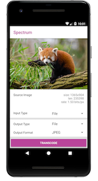
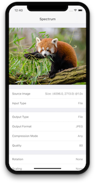

The Spectrum repository provides sample applications that allow developers to quickly test Spectrum. It also serves as a blueprint on how Spectrum can be integrated.

## Android

The Android sample app is written in Kotlin. You will first setup your local environment and clone the repository by following the instructions from [the contributing chapter](contributing_android.md). Afterwards, select the `sample` target in AndroidStudio to install it on your emulator or device.

You can find its [source code in our GitHub repository](https://github.com/facebookincubator/spectrum/tree/master/android/sample/src/main/java/com/facebook/spectrum/sample).

## iOS

The iOS Sample app is written is Swift. To launch it, navigate to `ios/SpectrumKitSample` and run `pod install`. Then, open the Xcode workspace.

You can find its [source code in our GitHub repository](https://github.com/facebookincubator/spectrum/tree/master/ios/SpectrumKitSample/SpectrumKitSample-iOS).
